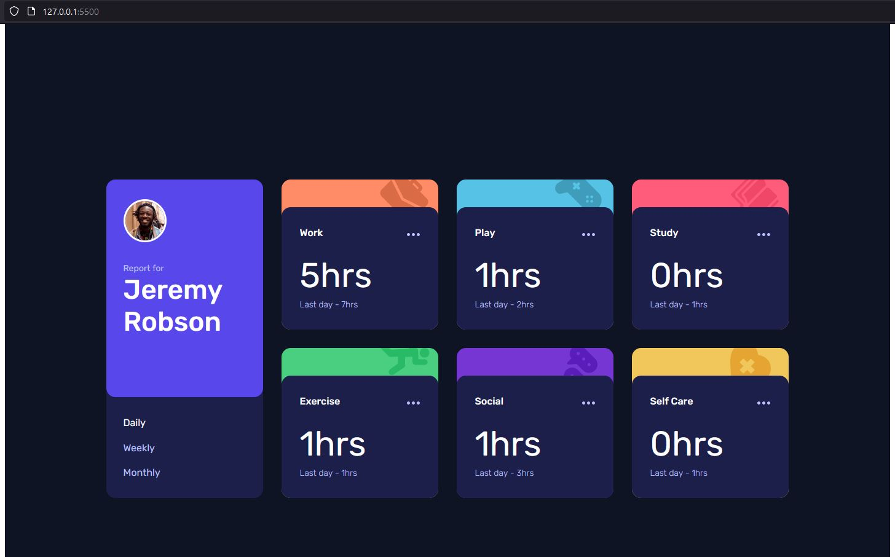
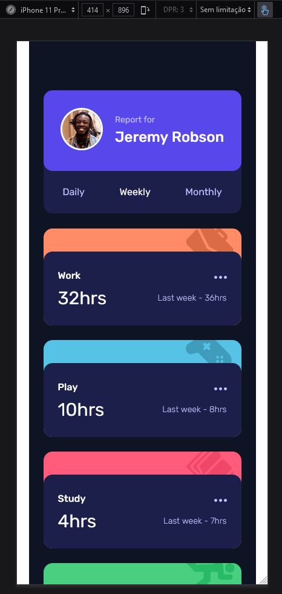

# Frontend Mentor - Time tracking dashboard solution

This is a solution to the [Time tracking dashboard challenge on Frontend Mentor](https://www.frontendmentor.io/challenges/time-tracking-dashboard-UIQ7167Jw). Frontend Mentor challenges help you improve your coding skills by building realistic projects. 

## Table of contents

- [Overview](#overview)
  - [The challenge](#the-challenge)
  - [Screenshot](#screenshot)
  - [Links](#links)
- [My process](#my-process)
  - [Built with](#built-with)
  - [What I learned](#what-i-learned)
  - [Continued development](#continued-development)
- [Author](#author)

## Overview

### The challenge

Users should be able to:

- View the optimal layout for the site depending on their device's screen size
- See hover states for all interactive elements on the page
- Switch between viewing Daily, Weekly, and Monthly stats

### Screenshot




### Links

- Solution URL: [Fronted Mentor Challenge](https://your-solution-url.com)
- Live Site URL: [Git Pages](https://marcioufrj.github.io/challenge-junior-time-tracking-dashboard/)

## My process

### Built with

- Semantic HTML5 markup
- CSS custom properties
- Flexbox
- CSS Grid
- JavaScript

### What I learned

```js
/* setting each DASHBOARD MENU ITEM event listener */
for (var i = 0; i < elemMenuDashboardItems.length; i++) {
  elemMenuDashboardItems[i].addEventListener('click', function() {
    var current = document.getElementsByClassName('menu-dashboard-item active');
    current[0].className = current[0].className.replace(' active', '');
    this.className += ' active';

    setDashboardValues(this.innerText.toLowerCase());
  })
}
```

### Continued development

This was a big challenge to my JavaScript skills. I had to research a lot in order to make the effects and dynamically change the dashboard values.

## Author

- Frontend Mentor - [@marcioUfrj](https://www.frontendmentor.io/profile/marcioUfrj)
- Twitter - [@tsukimi_23](https://www.twitter.com/tsukimi_23)